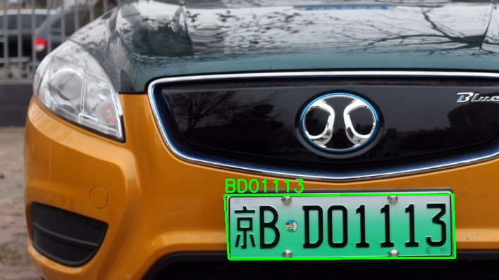

# License Plate Detection with YuNet

License Plate Detection using YuNet is a Python project that leverages the LPD-YuNet model for accurate and efficient license plate detection in images. The project uses OpenCV for computer vision tasks, EasyOCR for Optical Character Recognition (OCR), and interacts with a MySQL database to store the detected license plate information

Please note that the model is trained with Chinese license plates, so the detection results of other license plates with this model may be limited.

## Features

1. **LPD-YuNet Model**: Utilizes the LPD-YuNet model for robust license plate detection.
2. **EasyOCR Integration**: Integrates EasyOCR for accurate text extraction from license plates.
3. **MySQL Database**: Stores detected license plate information in a MySQL database.
4. **Command-Line Interface (CLI)**: Provides a user-friendly CLI for easy interaction.
5. **Customizable Options**: Allows users to specify input images, model paths, and saving options

## How to Use

1. Clone the repository:

```
git clone https://github.com/roniragilimankhoirul/Automatic-Number-Plate-Recognition.git && cd Automatic-Number-Plate-Recognition
```

2. Create a virtual environment:

```
python -m venv myenv
```

3. Activate the virtual environments:

```
source myenv/bin/activate
```

4. Install Dependencies:

```
pip install -r requirements.txt
```

5. Set up your environment by creating a .env file with the following variables:

```
DB_HOST=your_database_host
DB_USER=your_database_user
DB_PASSWORD=your_database_password
DB_NAME=your_database_name
```

6. Run the image detection program:

```
python main.py --input path/to/your/image.jpg -v
```

7. Run the image detection program and save to database:

```
python main.py --input path/to/your/image.jpg -v -s
```

7. Run to see customizable options

```
python main.py --help
```

### Example outputs


